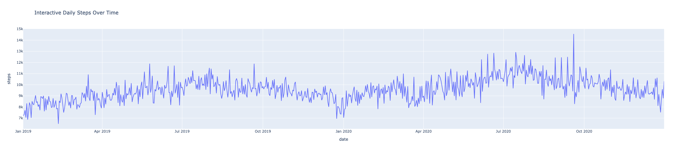
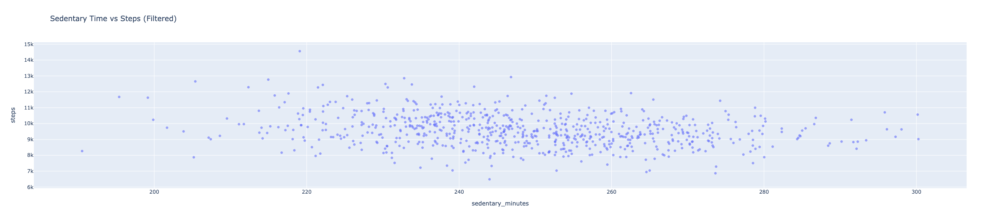

## Week 12 Update

### Exploratory Analysis

This week, I conducted exploratory analysis on both the activity and weather datasets to better understand their structure and patterns before combining them.

For the activity dataset, I aggregated the data to a daily level by averaging across all participants. I then explored trends in daily steps, distributions of activity levels, and the relationship between sedentary time and steps. The analysis showed a weak negative correlation between sedentary time and steps, suggesting that higher inactivity is associated with lower movement, though the relationship is not strong.

For the weather dataset, I converted hourly data into daily averages and examined temperature trends and precipitation patterns. The data shows clear seasonal variation in temperature and a highly skewed distribution of precipitation, with many days having little to no rainfall.

### Interactive Visualization

### Daily Steps Over Time

This visualization shows how average daily steps change over time. The data reveals noticeable variability and suggests possible seasonal patterns in physical activity levels.

### Sedentary Time vs Steps

This scatter plot illustrates the relationship between sedentary time and daily steps. The data shows a weak negative relationship, indicating that higher sedentary behavior is generally associated with lower physical activity, though the effect is not strong.

### Key Insights

- Daily activity levels show variability over time with some seasonal patterns.
- Sedentary time and steps are negatively related, but only weakly.
- Weather variables, especially temperature, show strong seasonal trends.
- Precipitation is unevenly distributed, with many low values and a few extreme events.

### Next Steps

Next, I will merge the activity and weather datasets by date and analyze how weather conditions influence daily activity behavior.
